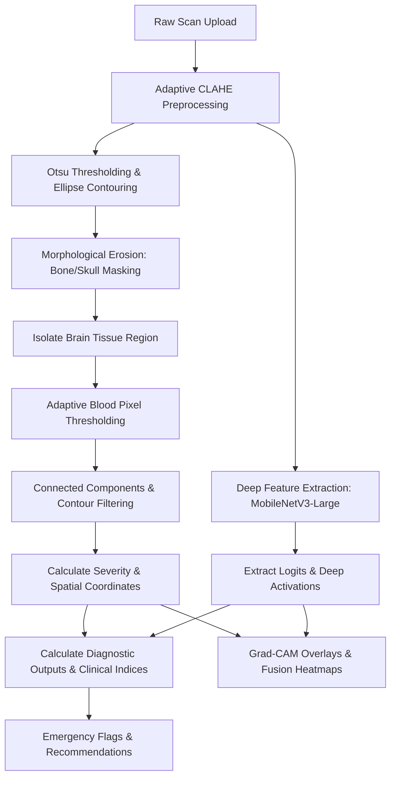

# Clinical AI Diagnostics: Brain Hemorrhage & Stroke Risk Suite - Complete Project Overview

This document provides a comprehensive technical, architectural, and clinical overview of the **Clinical AI Diagnostics: Brain Hemorrhage & Stroke Risk Suite** platform. This medical assistant portal is engineered to run lightweight, high-precision diagnostic assessments of brain CT/MRI scans directly on CPU-bound hardware, generating detailed patient risk reports, dynamic clinical indices, and real-time visualization overlays.

---

## 🎯 1. Executive Summary & Core Goals

The **Clinical AI Diagnostics Suite** addresses the critical clinical need for rapid, automated triage of head CT/MRI scans. Key objectives of the system are:
1. **Automated Hemorrhage Detection:** Identifies the presence of blood pooling in brain tissues and estimates the cross-sectional severity of bleeding.
2. **Anatomical Localization:** Classifies the hemorrhage location among primary spaces: **Epidural**, **Subdural**, **Subarachnoid**, and **Intracerebral**, or logs **Multiple** hemorrhage sites.
3. **Advanced Clinical Indexing:** Computes urgency metrics such as the **Intervention Delay Index (IDI)**, **Hematoma Expansion Rate (HER)**, and **Seizure Risk Score (SRS)** to guide clinical priority.
4. **Epilepsy Prediction:** Utilizes a dedicated **Post-Hemorrhagic Epilepsy (PHE) Predictor** to assess early (7-day) and late (long-term) seizure probability.
5. **Dynamic Visual Overlays:** Employs a hybrid **Grad-CAM Fusion** map blending deep network features with contour-based hyperdensity masks.
6. **Administrative Insights:** Compares model performance across **Kaggle vs Real-Time datasets** and manages emergency case triage.

---

## 📂 2. Project Directory Structure

The project follows a clean, decoupled client-server architecture:

```text
NeuroAI_Diagnostics-Brain_Hemorrhage_and_Stroke_Risk_Detection/
├── backend/
│   ├── database/                   # Auto-created SQLite database directory
│   │   └── brain_hemorrhage.db     # SQLite Database File
│   ├── uploads/                    # Stores uploaded raw medical brain scans
│   ├── heatmaps/                   # Stores generated Grad-CAM heatmaps and masks
│   ├── routes/                     # Modular FastAPI endpoint handlers
│   │   ├── __init__.py
│   │   ├── auth.py                 # User authentication and emergency intake
│   │   ├── reports.py              # Upload, analyze, export, and epilepsy predictions
│   │   └── admin.py                # Graph analysis, triage trackers, and audit tools
│   ├── services/                   # Advanced AI Diagnostic processors
│   │   ├── __init__.py
│   │   ├── ai_inference.py         # Primary AI prediction, metrics, and thresholding logic
│   │   ├── heatmap_generator.py    # Grad-CAM forward/backward hook activations
│   │   ├── pdf_generator.py        # ReportLab-based clinical PDF builder
│   │   └── documentation.py        # Core medical education documentation texts
│   ├── database.py                 # SQLAlchemy engine configuration
│   ├── models.py                   # User and Report SQLAlchemy schema definitions
│   ├── schemas.py                  # Pydantic schemas for endpoint validation
│   ├── auth.py                     # Password salting/hashing and JWT utilities
│   ├── main.py                     # FastAPI entrypoint, lifespan seeding, and CORS rules
│   ├── requirements.txt            # Python dependencies (PyTorch CPU, OpenCV, etc.)
│   └── .env                        # Port configurations and secret JWT keys
│
└── frontend/
    ├── src/
    │   ├── components/             # Reusable UI cards and modals
    │   │   ├── MedicalDisclaimer.jsx
    │   │   ├── ProtectedRoute.jsx
    │   │   ├── Navbar.jsx
    │   │   ├── Sidebar.jsx
    │   │   ├── ReportCard.jsx
    │   │   └── EmergencyAccountModal.jsx
    │   ├── context/
    │   │   └── AuthContext.jsx      # Global React Context API for auth and session API hooks
    │   ├── pages/                  # Responsive clinician portal modules
    │   │   ├── Landing.jsx          # Public hero splash page
    │   │   ├── About.jsx            # Project overview and parameters documentation
    │   │   ├── Login.jsx            # Doctor login panel
    │   │   ├── Register.jsx         # New clinician registration page
    │   │   ├── Dashboard.jsx        # Unified clinician dashboard with recent scans
    │   │   ├── UploadScan.jsx       # Drag-and-drop uploader with real-time analysis logs
    │   │   ├── AnalysisResult.jsx   # Results panel with side-by-side scans and interactive PHE
    │   │   ├── GraphAnalytics.jsx   # Admin charts (location, correlation, dataset comparison)
    │   │   ├── AdminDashboard.jsx   # Cohort ledgers and clinician directories
    │   │   ├── Profile.jsx          # User credentials and backup JSON exports
    │   │   ├── History.jsx          # Searchable, sorted, and paginated logs list
    │   │   ├── EpilepsyPrediction.jsx# Standalone interactive PHE Calculator UI
    │   │   ├── AwarenessDocumentation.jsx# Medical education and patient guide center
    │   │   └── NotFound.jsx         # Fallback 404 page
    │   ├── App.jsx                 # Client router mappings and guards
    │   ├── main.jsx                # DOM mounting triggers
    │   └── index.css               # Global styling, custom glassmorphism, and scrollbars
    ├── index.html                  # Viewport, fonts, and SEO configurations
    ├── tailwind.config.js          # Tailwind styling rules (if active)
    ├── postcss.config.js
    └── package.json                # React packages directory
```

---

## 🗄️ 3. Database Schema

The SQLite database is managed via SQLAlchemy in [backend/models.py](file:///c:/Users/namit/Desktop/tech_Projects/AIML/NeuroAI_Diagnostics-Brain_Hemorrhage_and_Stroke_Risk_Detection/backend/models.py). It tracks two main tables:

### A. The `users` Table
Stores registered clinicians, administrators, and auto-generated temporary emergency accounts.

| Column Name | Data Type | Modifiers / Description |
| :--- | :--- | :--- |
| `id` | `INTEGER` | Primary Key, Index |
| `name` | `VARCHAR` | Clinician's full name |
| `email` | `VARCHAR` | Unique, Index, Authentication email |
| `password` | `VARCHAR` | Secured hash salted and compiled using `bcrypt` |
| `role` | `VARCHAR` | Default: `'user'` (Options: `'user'`, `'admin'`) |
| `is_emergency_account`| `BOOLEAN` | Default: `FALSE`. Enables instant uploads in critical settings. |
| `emergency_created_at`| `DATETIME` | Nullable. Tracks registration window for temp accounts. |
| `created_at` | `DATETIME` | Timestamp of registration (Default: UTC `now`) |

### B. The `reports` Table
Stores detailed clinical outputs, computed index matrices, locations, segmentation parameters, and neurologist review status.

| Column Name | Data Type | Description |
| :--- | :--- | :--- |
| `id` | `INTEGER` | Primary Key, Index |
| `user_id` | `INTEGER` | ForeignKey (`users.id` with `ON DELETE CASCADE`) |
| `image_path` | `VARCHAR` | Path to raw uploaded scan |
| `heatmap_path` | `VARCHAR` | Path to Grad-CAM heatmap overlay |
| `prediction` | `VARCHAR` | `"Hemorrhage Detected"` or `"Normal (No Hemorrhage)"` |
| `confidence` | `FLOAT` | General diagnostic confidence (0.0 to 100.0) |
| `hemorrhage_percentage`| `FLOAT` | Severity index based on blood area (capped at 15.0%) |
| `stroke_risk` | `FLOAT` | Stroke risk index (0.0 to 100.0) |
| `epilepsy_risk` | `FLOAT` | Combined probability of post-hemorrhagic epilepsy (0.0 to 100.0) |
| `risk_level` | `VARCHAR` | Risk categorizations (`"Low"`, `"Moderate"`, `"High"`) |
| `hemorrhage_detection_score`| `FLOAT` | Likelihood presence score |
| `hemorrhage_location` | `VARCHAR` | Primary bleeding space (Epidural, Subdural, Subarachnoid, Intracerebral, Multiple) |
| `location_confidence` | `FLOAT` | Anatomical location classification confidence (0.0 to 1.0) |
| `dataset_source` | `VARCHAR` | Performance tracking origin (`"kaggle"` or `"real-time"`) |
| `model_accuracy` | `FLOAT` | Model accuracy metric for benchmarking |
| `is_emergency` | `BOOLEAN` | Flags cases with stroke risk > 75% or epilepsy risk > 70% |
| `first_aid_needed` | `BOOLEAN` | Flags emergency first-aid advice generation |
| `first_aid_recommendations`| `TEXT` | Detailed markdown emergency medical guidelines |
| `hemorrhage_distribution` | `VARCHAR` | JSON string of hemorrhage pixel distribution by quadrants |
| `cortical_involvement` | `BOOLEAN` | Cortical contact indicator |
| `hemorrhage_volume` | `FLOAT` | Estimated hemorrhage volume in mL |
| `midline_shift` | `FLOAT` | Estimated midline shifting distance in mm |
| `early_seizure_risk` | `FLOAT` | 7-day early seizure probability (0.0% to 90.0%) |
| `late_epilepsy_risk` | `FLOAT` | Long-term late epilepsy risk (0.0% to 95.0%) |
| `patient_age` | `INTEGER` | Patient age associated with the scan |
| `prob_hemorrhage` / `prob_edh` / `prob_sdh` / `prob_sah` / `prob_iph` / `prob_ivh` / `prob_fracture` | `FLOAT` | Individual multi-label classification probabilities |
| `idi` | `FLOAT` | **Intervention Delay Index** urgency score |
| `her` | `FLOAT` | **Hematoma Expansion Rate** probability percentage |
| `srs` | `FLOAT` | **Seizure Risk Score** based on proximity variables |
| `treatment_recommendation`| `VARCHAR` | Action timeline (e.g. `"Immediate (<1 hour)"`) |
| `esi` / `rcf` / `hi` / `sfs` / `ev` / `cp` | `FLOAT` | Multi-task indices (Edema, Rehab, Hemosiderin, Sleep, Electrolyte, Proximity) |
| `primary_diagnosis` / `secondary_diagnosis` | `VARCHAR` | Primary and secondary multi-label classifications |
| `multilabel_matrix` | `TEXT` | Raw JSON string mapping out the full multi-label probabilities |
| `affected_region` | `VARCHAR` | Specific brain region affected by bleed |
| `region_confidence` / `region_percentage` | `FLOAT` | Spatial metrics of regional involvement |
| `segmentation_mask_path` | `VARCHAR` | Path to segmented binary mask (blood contours) |
| `total_hemorrhage_area` | `FLOAT` | Calculated pixel area of hemorrhage |
| `ischemic_stroke_risk` / `hemorrhagic_stroke_risk` / `recurrent_stroke_risk` | `FLOAT` | Structured stroke prediction sub-risks |
| `has_diabetes` / `has_hypertension` / `has_smoking_history` | `BOOLEAN` | Patient clinical history flags |
| `blood_pressure` | `VARCHAR` | Blood pressure reading (e.g., `'145/90'`) |
| `survival_30d` / `survival_1y` | `FLOAT` | Quantitative patient survival probability indices |
| `gcs_score` | `INTEGER` | Glasgow Coma Scale representation (3 to 15) |
| `ivh_presence` | `BOOLEAN` | Intraventricular hemorrhage indicator |
| `time_to_treatment` | `INTEGER` | Expected treatment response delay in hours |
| `recovery_score` / `functional_independence_prob` | `FLOAT` | Prognosis indicator scores |
| `rehabilitation_requirement` | `VARCHAR` | Recommended rehab type (e.g. Inpatient, Outpatient) |
| `recovery_outcome` | `VARCHAR` | Forecasted recovery level (Good, Moderate, Poor) |
| `triage_priority` | `INTEGER` | Emergency prioritization rank (1 to 4) |
| `triage_badge` / `triage_response_time` | `VARCHAR` | Visual priority classifications |
| `doctor_approved` | `VARCHAR` | Validation status (`'pending'`, `'approved'`, `'rejected'`) |
| `doctor_diagnosis` / `doctor_notes` | `TEXT` | Clinician overrides, signatures, and review remarks |

---

## 🧠 4. AI Diagnostics & Inference Pipeline

The core AI engine logic in [backend/services/ai_inference.py](file:///c:/Users/namit/Desktop/tech_Projects/AIML/NeuroAI_Diagnostics-Brain_Hemorrhage_and_Stroke_Risk_Detection/backend/services/ai_inference.py) uses a combined approach of **Computer Vision** (OpenCV skull/blood segmentation) and **Deep Learning** (MobileNetV3 feature extraction):



### Steps in the Pipeline:
1. **Adaptive Preprocessing:** Performs Contrast Limited Adaptive Histogram Equalization (CLAHE) on the grayscale scan, ensuring consistent density distributions across scanner models.
2. **Skull Masking & Bone Segmentation:** Isolates the high-density skull outline (Otsu's thresholding) and applies a 25x25 elliptical erosion operation to isolate brain parenchyma and mask out bone.
3. **Adaptive Blood Pooling Detection:** Computes adaptive thresholds based on tissue intensity:
   $$\text{Threshold}_{\text{blood}} = \max\left(190, \min\left(245, \mu_{\text{tissue}} + 1.5 \cdot \sigma_{\text{tissue}}\right)\right)$$
4. **Contour Area Filtering:** Connects hyperdense pixels and discards contours below the adaptive area threshold (median-scaled) to prevent false-positive noise from textual patient labels.
5. **Severity Capping:** Compares blood area to total brain tissue area. Severity percentage scales up and is capped at $15.0\%$, the maximum survivable acute intracranial hematoma index.
6. **MobileNetV3 Feature Extraction:** Extracts activations from the last convolution feature layers of PyTorch's `mobilenet_v3_large`.
7. **Grad-CAM Fusion:** Hooks register active deep convolution nodes, blending the deep feature map ($40\%$) with the binary hyperdense blood contour mask ($60\%$), smoothed with a 45x45 Gaussian kernel, overlaying details directly onto the original scan.

---

## 📊 5. Clinical Assessment Engine & Formulas

### A. Anatomical Location Classification
Classifies hemorrhage locations by evaluating the normalized center-of-mass (Y-axis coordinate) of detected blood contours:

| anatomical Space | Y-Coordinate Bounds | Base Confidence | Description / Clinical Details |
| :--- | :--- | :--- | :--- |
| **Epidural Hematoma** | $< 25\%$ | $85\%$ | Outermost space. Lucid interval risk. |
| **Subdural Hematoma** | $25\% - 50\%$ | $80\%$ | Venous bridging tears. Crescent shape. |
| **Subarachnoid Hemorrhage** | $50\% - 75\%$ | $85\%$ | CSF spaces. High thunderclap headache risk. |
| **Intracerebral Hemorrhage**| $\ge 75\%$ | $90\%$ | Deep parenchymal tissues. Focal deficits. |
| **Multiple** | $> 2$ contours | $95\%$ | Multi-space hemorrhage patterns. |

---

### B. Stroke & Epilepsy Risk Correlation
Calculates the default baseline Epilepsy Risk using:

$$\text{Epilepsy Risk} = \min\left(90\%, \max\left(5\%, (\text{Severity} \times 0.5) \times \text{Multiplier}_{\text{location}} + (\text{Stroke Risk} \times 0.15)\right)\right)$$

Where the $\text{Multiplier}_{\text{location}}$ values are:
* Subarachnoid Hemorrhage: **1.6** (Highest risk due to cortical CSF irritation)
* Intracerebral Hemorrhage: **1.5** (Direct parenchymal irritation)
* Subdural Hematoma: **1.3**
* Epidural Hematoma: **1.1** (Lowest risk)
* Multiple: **1.8**

---

### C. Post-Hemorrhagic Epilepsy (PHE) Predictor
Uses the parameters: Hemorrhage Location, Cortical Involvement (boolean), Hemorrhage Volume (mL), Midline Shift (mm), and Patient Age to compute early and late risks:

* **Early Seizure Risk (7-Day):**
  $$\text{Early Risk} = \text{Base}_{\text{Early}} + (20.0 \text{ if Cortical}) + \min(25.0, \text{Volume} \times 0.4) + \min(15.0, \text{Shift} \times 1.5)$$
  *(Base: SAH/ICH/Multiple = 15.0; SDH = 10.0; EDH = 5.0)*

* **Late Epilepsy Risk (Long-Term):**
  $$\text{Late Risk} = \text{Base}_{\text{Late}} + (25.0 \text{ if Cortical}) + \min(30.0, \text{Volume} \times 0.5) + \min(20.0, \text{Shift} \times 2.0)$$
  *(Base: SAH/ICH/Multiple = 20.0; SDH = 12.0; EDH = 4.0)*

* **Combined Seizure Probability:**
  $$P_{\text{Combined}} = P_{\text{Early}} + P_{\text{Late}} - \left(P_{\text{Early}} \times P_{\text{Late}}\right)$$

---

### D. Advanced Urgency & Triage Indices
* **Intervention Delay Index (IDI):** Summarizes patient urgency based on the multi-label class probabilities:
  $$\text{IDI} = \sum \left(w_i \times p_i \times s_i\right)$$
  *(Weights $w_i$: IPH = 3.0, EDH = 2.8, IVH = 2.5, SAH = 2.0, SDH = 1.5)*
  * IDI $\ge 7.0 \rightarrow$ **Immediate (<1 hour)**
  * IDI $\ge 3.0 \rightarrow$ **Urgent (1–6 hours)**
  * IDI $\ge 1.0 \rightarrow$ **Semi-Urgent (6–24 hours)**
  * Otherwise $\rightarrow$ **Routine (>24 hours)**

* **Hematoma Expansion Rate (HER):** Evaluates bleeding expansion risk:
  $$\text{HER} = \left(0.30 \times P_{\text{IPH}} + 0.20 \times P_{\text{IVH}} + 0.15 \times P_{\text{SAH}}\right) \times 100$$

* **Seizure Risk Score (SRS):**
  $$\text{SRS} = \left(2.5 \times P_{\text{IPH}} \times \text{CP} + 1.8 \times P_{\text{IVH}} \times \text{CP} + 1.5 \times P_{\text{SAH}} \times \text{CP}\right)$$

---

## 📈 6. Core System Features

### 1. Interactive Epilepsy Predictor Calculator
Integrated directly in the clinician interface at [/analysis-result](file:///c:/Users/namit/Desktop/tech_Projects/AIML/NeuroAI_Diagnostics-Brain_Hemorrhage_and_Stroke_Risk_Detection/frontend/src/pages/AnalysisResult.jsx), allowing medical staff to adjust parameters (Age, Shift, Volume, Location) in real-time. Displays driver impact break-downs using horizontal bar graphs (Recharts).

### 2. Dataset Accuracy Comparison
A validation engine tracking dataset accuracy differences between **Kaggle** reference scans and **Real-Time** clinical uploads:
* Monitors scan count, accuracy rates, and precision.
* Provides warnings if local real-world scans deviate significantly in precision from standardized model baselines.

### 3. Emergency Account System
Enables rapid triage in emergency rooms. Clinicians can input name and email to get a temporary account with a 12-character password. Logs emergency accounts via:
* `User.is_emergency_account = True`
* `User.emergency_created_at = datetime.utcnow()`

### 4. Interactive Analytics Dashboard
Accessible by administrators at [/graph-analytics](file:///c:/Users/namit/Desktop/tech_Projects/AIML/NeuroAI_Diagnostics-Brain_Hemorrhage_and_Stroke_Risk_Detection/frontend/src/pages/GraphAnalytics.jsx). Features:
* Pie chart for location distributions.
* Bar chart showing stroke-epilepsy correlation.
* Scatter plot charting risk vs. severity metrics.

### 5. Multi-Column PDF Report Generation
Constructs clinical PDF reports using a professional header layout and grid metadata. Embeds original scans and heatmaps side-by-side on a separate page to ensure proper visual formatting.

---

## 🔌 7. API Routing Architecture

FastAPI exposes the following key endpoints:

| Method | Endpoint | Description |
| :--- | :--- | :--- |
| `POST` | `/api/auth/register` | Registers a new clinician |
| `POST` | `/api/auth/login` | Clinician login (returns JWT token) |
| `POST` | `/api/auth/emergency-account` | Creates temporary emergency account |
| `POST` | `/api/reports/analyze` | Uploads raw scan, runs segmentation and AI inference |
| `POST` | `/api/reports/predict-epilepsy`| Evaluates customized parameters for epilepsy probability |
| `GET` | `/api/reports/{id}/pdf` | Downloads formatted ReportLab PDF report |
| `GET` | `/api/admin/graph-analysis/location-distribution` | Location stats for analytics dashboard |
| `GET` | `/api/admin/graph-analysis/stroke-epilepsy-correlation` | Stroke-Epilepsy scatter coordinates |
| `GET` | `/api/admin/graph-analysis/dataset-accuracy-comparison` | Kaggle vs Real-Time accuracy metrics |
| `GET` | `/api/admin/emergency-scans` | Emergency cases list sorted by stroke risk |

---

## 🛠️ 8. Verification & Local Launch Instructions

### A. Backend Server Setup
From the folder `backend/`:
1. **Initialize Virtual Env:**
   ```powershell
   python -m venv venv
   ```
2. **Activate Environment:**
   ```powershell
   .\venv\Scripts\Activate.ps1
   ```
3. **Install Dependencies:**
   ```powershell
   pip install -r requirements.txt
   ```
4. **Run Server:**
   ```powershell
   uvicorn main:app --reload --port 8000
   ```

### B. Frontend Client Setup
From the folder `frontend/`:
1. **Install Packages:**
   ```powershell
   npm install
   ```
2. **Run Dev Environment:**
   ```powershell
   npm run dev
   ```

### C. Demo Authentication Coordinates
* **Administrator Portal:**
  * **Email:** `admin@brainai.com`
  * **Password:** `admin123`
* **Standard Clinician Portal:** Create a new profile using the registration page.
